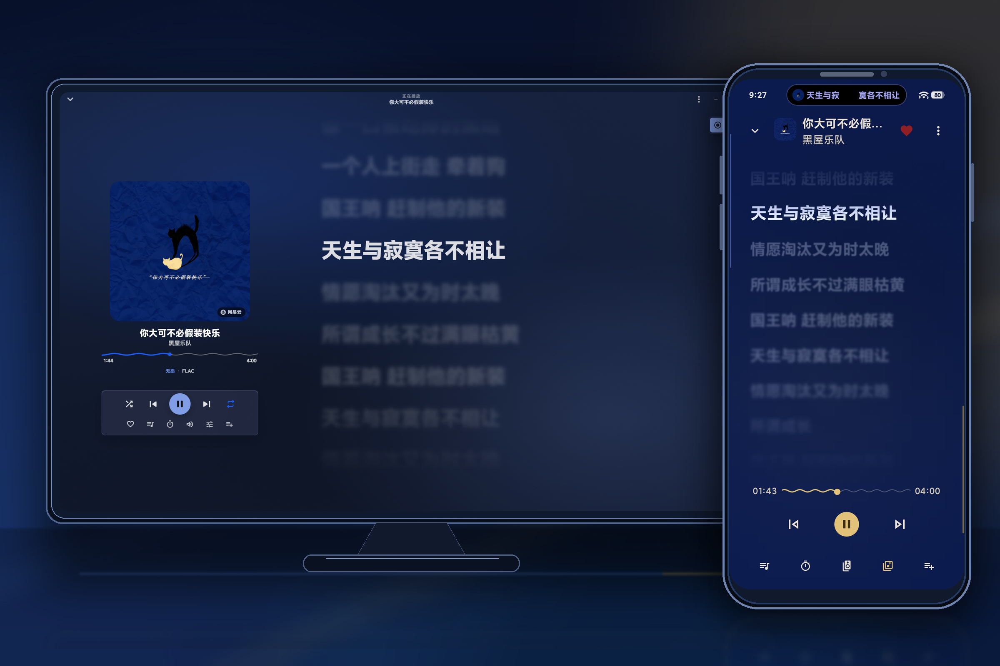

<p align="center">
  
</p>

<h1 align="center">NeriPlayer Desktop</h1>

<p align="center">
  面向 Windows、macOS 与 Linux 的多源音乐播放器<br>
  A multi-source music player for Windows, macOS, and Linux
</p>

<p align="center">
  <a href="https://github.com/issunmihaichi/NeriPlayer-Desktop/actions/workflows/build.yml"></a>
  <a href="https://github.com/issunmihaichi/NeriPlayer-Desktop/releases"></a>
  
  
  <a href="./LICENSE"></a>
</p>

> [!WARNING]
> **Work in progress / 开发中**
>
> 项目仍在快速迭代，功能、协议和本地数据结构可能发生变化。请勿将当前构建视为稳定版本。

## 界面预览 / Preview

<p align="center">
  
</p>

桌面端延续 Android 版 NeriPlayer 的播放逻辑与歌词体验，并针对大屏操作重新组织音乐库、播放控制和独立桌面歌词。

## 核心能力 / Highlights

| 模块 | 当前能力 |
| --- | --- |
| 网易云音乐 | 账号登录与会话恢复、推荐与歌单、分类筛选、搜索、收藏及下载 |
| 多源入口 | Bilibili 与 YouTube 搜索、歌单及音乐库入口 |
| 自动换源 | 网易云歌曲无可用音源时自动尝试 Bilibili 播放源 |
| 播放与歌词 | 播放队列、动态歌词、封面/歌词视图切换、独立桌面歌词窗口 |
| 音乐库 | 本地音乐、收藏、下载记录，以及按播放源区分的歌单集合 |
| 跨端体验 | Android 配置与播放列表导入、一起听房间与共享播放状态 |
| 桌面集成 | Windows、macOS、Linux 桌面构建，日志目录与可靠的窗口关闭流程 |

## 下载 / Downloads

- 稳定版与预发布版本：[GitHub Releases](https://github.com/issunmihaichi/NeriPlayer-Desktop/releases)
- 最新开发构建：[GitHub Actions](https://github.com/issunmihaichi/NeriPlayer-Desktop/actions)

开发构建仅供测试。账号 Cookie、同步凭据和本地媒体数据请自行妥善保管。

## 本地开发 / Development

### 环境要求

- [Node.js](https://nodejs.org/) 20 或更高版本
- [pnpm](https://pnpm.io/) 9.15.9
- [Rust](https://www.rust-lang.org/tools/install) stable
- 对应平台的 [Tauri 2 prerequisites](https://v2.tauri.app/start/prerequisites/)

### 获取与运行

```bash
git clone --recurse-submodules https://github.com/issunmihaichi/NeriPlayer-Desktop.git
cd NeriPlayer-Desktop
pnpm install
pnpm tauri dev
```

已经克隆但缺少歌词子模块时：

```bash
git submodule update --init --recursive
```

### 构建与检查

```bash
pnpm build
pnpm test:netease
cargo check --manifest-path src-tauri/Cargo.toml --locked
pnpm tauri build
```

各平台安装包和便携产物由 GitHub Actions 分别构建。跨平台改动请至少确认前端构建、Rust 检查及目标系统上的基本播放流程。

## 项目关系 / Android parity

桌面端以 [NeriPlayer for Android](https://github.com/cwuom/NeriPlayer) 的产品逻辑为参照，复用兼容的数据与同步约定，同时保留适合桌面环境的窗口、快捷操作和多栏布局。

## 鸣谢 / Reference

<table>
<tr>
  <td><a href="https://github.com/amll-dev/applemusic-like-lyrics">applemusic-like-lyrics</a></td>
  <td>An Apple Music style lyric player component with React and Vue support. / 一个类 Apple Music 的歌词显示组件，同时提供 React 和 Vue 绑定。</td>
</tr>
<tr>
  <td><a href="https://github.com/cwuom/NeriPlayer">NeriPlayer (Android)</a></td>
  <td>A native Android audio player that combines multi-source streaming, local control, rich lyrics, and self-hosted sync. / 一个把多源在线播放、本地管理、歌词体验和自建同步带入原生 Android 的音频播放器。</td>
</tr>
</table>

## 许可 / License

本项目基于 [MIT License](./LICENSE) 开源。
